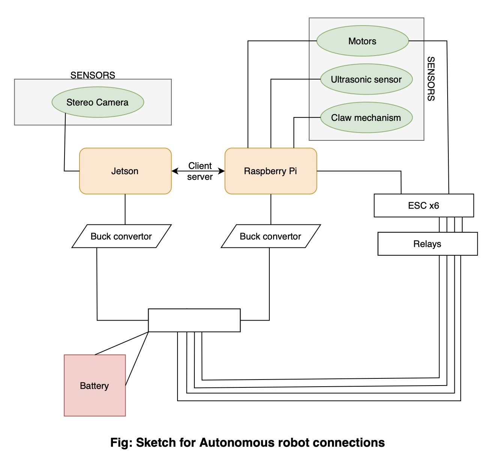

# ROBOCON-MU

This repository contains the code for the autonomous robot for DD-Robocon competition at IIT-Delhi. 


---
### 1.Description:
The task of the autonomous bot is to go from zone1 to zone3 autonomously. In zone3, the bot has to pick balls (either blue or red) depending on the team color, and place them into baskets. There are 5 baskets in the game and the bot wins the basket if: there are two balls in the basket and the top ball is the our team color, if all three balls in the basket are ours. Max number of balls in the basket are *three*.  

### 2. Requirements and installation:
The hardware components used for the Autonomous bot are: Jetson Xavier (edge computer used for AI tasks), and RasberryPi 4(microcontroller for communicating with motors).


**Requirements**
```
Python 3.8
Libraries used: OpenCV, Numpy, torch, Ultralytics, sys, serial

Torch version: 1.14.0a0+44dac51c.nv23.02
Torchvision version: 0.14.1a0+5e8e2f1
```

```
conda create -n env_name python=3.8
conda activate env_name
```

### 3. Code intuition:
The communication between the Jetson Xavier (client) and RasberryPi 4 (server) is a client-server communication. The client is used for all AI tasks such as detecting the objects: ball, basket, and sending the coordinates to the Pi for movement. In the Pi, there is an ultrasonic sensor attached for proximity/ distance estimation (where to stop to pick and drop the ball). We chose Yolo V8nano for the AI model as it has the highest inference speed, we chose to use this model for the AI tasks. 
The communication between the Jetson Xavier (client) and RasberryPi 4 (server) is a client-server communication. The client is used for all AI tasks such as detecting the objects: ball, basket, and sending the coordinates to the Pi for movement. In the Pi, an ultrasonic sensor is attached for distance estimation (where to stop for picking and droping the ball). 

---
